# AlarmGás - Detector de Vazamento de Gás Inflamável
### Manual para utilização do AlarmGás (Projeto desenvolvido para a disciplina de Técnicas de Programação, utilizando o Qt Creator e com uma interface Web)

### O que é o AlarmGás - Detector de Vazamento de Gás Inflamável?

O AlarmGás é um detector de vazamento de gás inflamável. É basicamente um dispositivo que detecta uma alta concentração de gás e de fumaça em um ambiente. Temos como objetivo através de nosso dispositivo, verificar a concentração do gás no ambiente e também alertar a você usuário de maneira luminosa, sonora e visual a ocorrência de um vazamento de gás.

### Como utilizar o AlarmGás?

A interface do AlarmGás é bem simples e de fácil entendimento. Em sua tela inicial temos os seguintes campos: Serial, Estado de Funcionamento, Concentração (ppm) e um botão Desligar Sistema. A seguir falaremos sobre cada um deles.

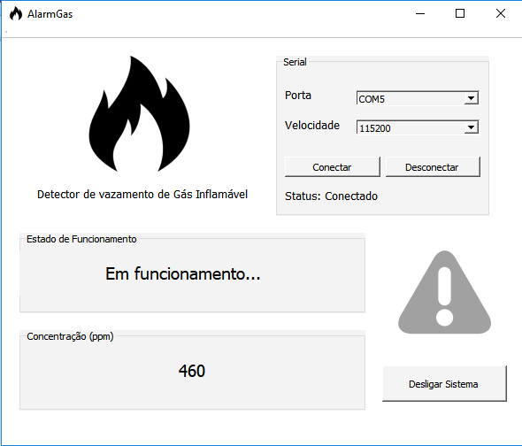

### Serial/Conexão

Para utilizar o nosso sistema, é importante primeiramente fazer a conexão com a ESP presente em nosso circuito. Para isto, se faz necessário selecionar a porta USB através da ComboBox "Porta" e em seguida selecionar a velocidade através da ComboBox "Velocidade" (OBS.: Para que funcione perfeitamente, selecione a velocidade 115200).

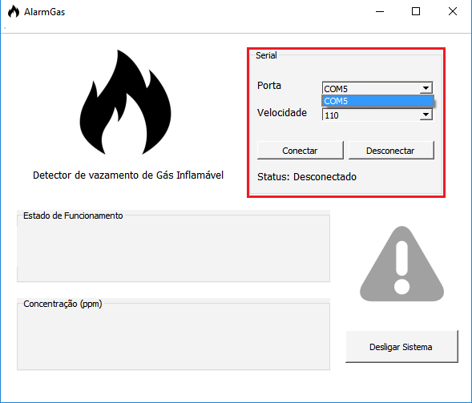

Depois de selecionada a porta e a velocidade, basta clicar no botão "Conectar" e você estará conectado. Caso deseja desconectar, utilize o botão "Desconectar". O "Status" mostra a situação atual da conexão.

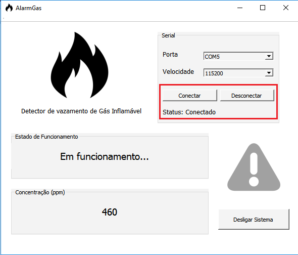

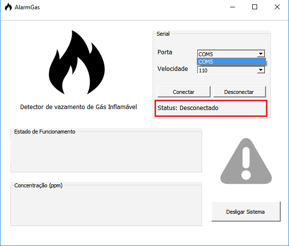

### Estado de Funcionamento

Em Estado de Funcionamento, você consegue observar em que situação se encontra o dispositivo. Neste campo serão mostradas duas mensagens. A primeira mensagem diz: "Em funcionamento...", ou seja, o dispositivo está funcionando e não há vazamento de gás ou detecção de fumaça no ambiente.

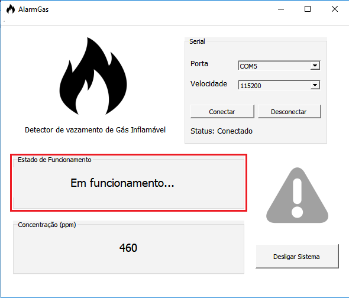

A segunda mensagem diz: "PERIGO! NÍVEL ALARMANTE". Esta mensagem indica que o dispositivo detectou uma alta concentração de gás ou fumaça no ambiente.

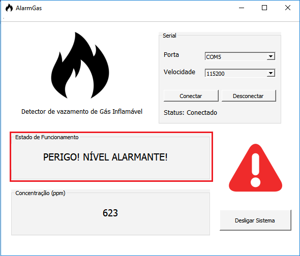

### Concentração (ppm)

Na tela da Concentração, você pode acompanhar o valor da concentração de gás presente no ambiente. É importante destacar que se a concentração for superior a 600ppm você será alertado.

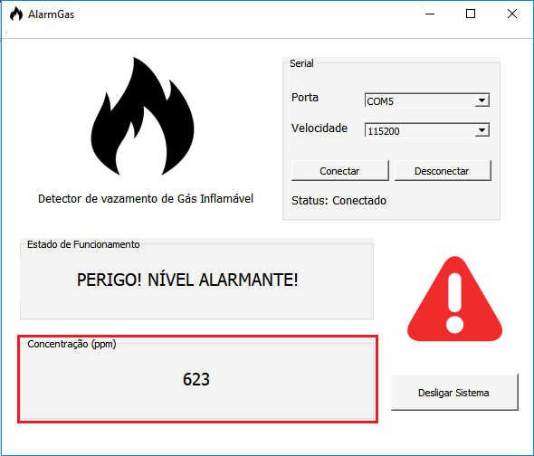

### Desligar Sistema

Através do botão "Desligar Sistema" é possível você desligar o alarme. Fazendo com que o sistema seja reiniciado, deixando apto para uma nova detecção de um possível vazamento de gás ou uma alta concentração de fumaça.

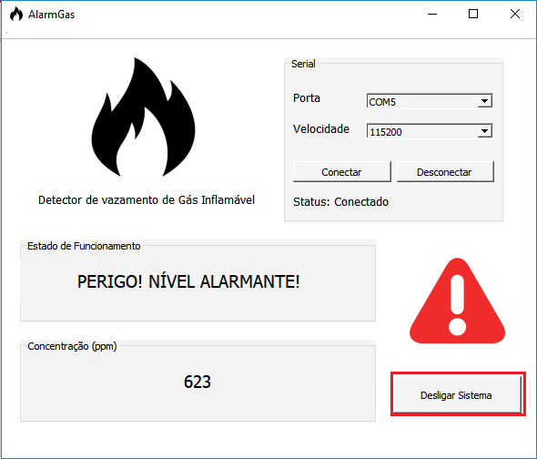

### Como utilizar o AlarmGás Web?

Para acessar a interface o web utilize este endereço: http://alarmgas.herokuapp.com/

Na interface Web, temos os seguintes campos: Concentração(ppm) e Alarme (Status de funcionamento e botão Desligar Alarme). A seguir falaremos sobre cada um deles.

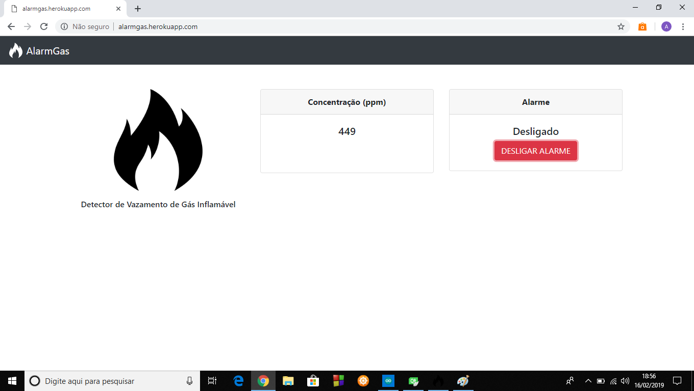

### Concentração (ppm)

Da mesma maneira que ocorria na outra interface, na tela da Concentração, você pode acompanhar o valor da concentração de gás presente no ambiente.

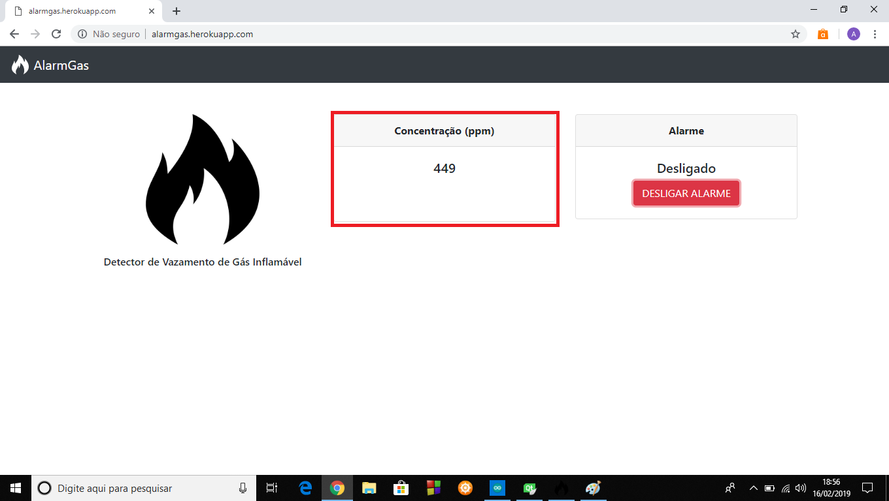

### Alarme

Em alarme, você pode visualizar a situação do sistema, ou seja, se está Desligado ou Ligado. E através do botão "DESLIGAR ALARME" é possível você desligar o alarme reiniciando o sistema, deixando apto para uma nova detecção de um possível vazamento de gás ou uma alta concentração de fumaça.

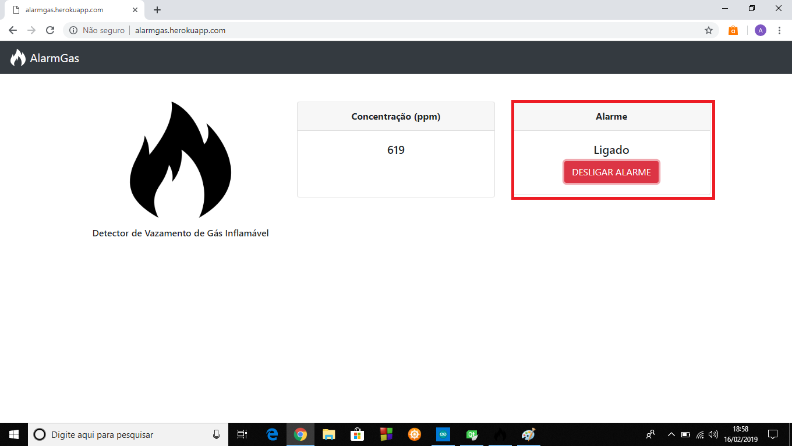

### Obrigado por escolher o AlarmGás! 

Para mais informações entre em contato conosco:
- Artur Barôncio (83) 99820-8771
- Jessly Smith (83) 98663-0502
